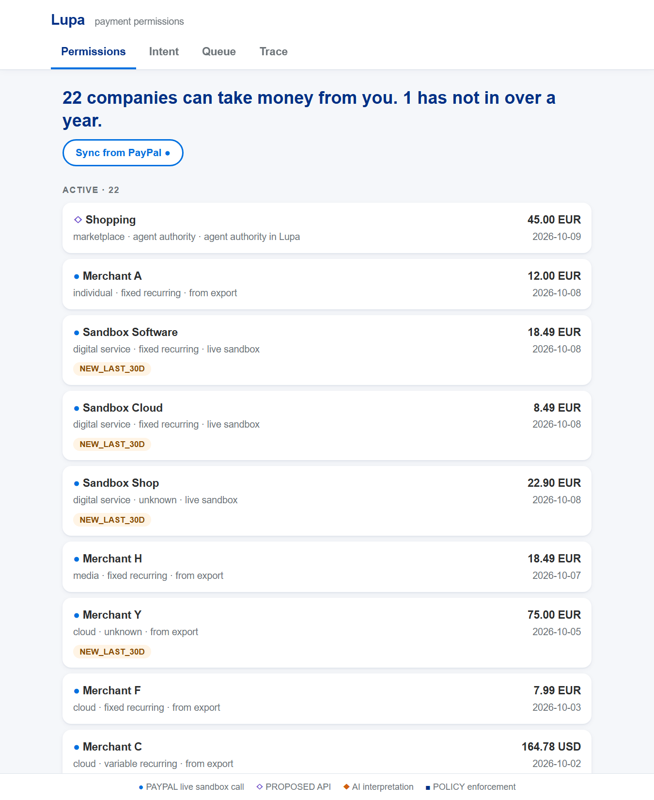

# Lupa

Lupa is a proposal for a new API: the buyer's side of agentic payments. It lets a person, or an
app working for them, see which companies and agents can take money from their account, set
limits on them, give an AI agent a bounded budget and approve what falls outside it. PayPal has
no such API today, so I built a working prototype of it on the PayPal sandbox.

The web portal and the MCP server in this repository are two example tools built on the API.
The portal looks a lot like ordinary payment history, and that is on purpose. The customer
experience does not need to change much. The new part is what a developer can do through the
API.

Lupa is Finnish and means permit.

- Video: [fill: YouTube link]
- Hosted demo: https://lupa.helppox.com (portal) and https://lupa.helppox.com/docs (the API, Swagger UI)
- API reference: [docs/api-reference.md](docs/api-reference.md)

## Why

With great power comes great responsibility. AI agents are starting to pay for things on our
behalf, and to be comfortable with that we need a way to see and limit what they do. Already
today many people do not know which subscriptions and autopay setups they have with which
vendors. Lupa found 20 payment permissions in my own PayPal history, and one of them had not
charged anything in over a year but was still allowed to. Agents paying on top of that blurs the line even more.

The payment APIs we have are built for the merchant. A merchant can create an order, a
subscription or a billing agreement. The buyer gets a settings page. There is no API for the
buyer's side, so nobody can build the tools that would watch over these permissions or hand a
safe slice of them to an agent. Instead of waiting for one, I wrote down what it could look like
and made it run.

## What the API does

All endpoints are under `/proposed/v1/me`. Full details in the
[API reference](docs/api-reference.md).

| Area | Endpoints |
|---|---|
| Payment permissions | list, show, revoke, suspend, suggested limit, explain |
| Policies | per permission or account default: limit, recurring, price increases, new merchants, monthly cap, expiry. Or draft one from a sentence. |
| Delegations | give an agent part of a permission: max amount, no subscriptions, how sure it must be, until when |
| Payment requests | a merchant or an agent asks to pay; Lupa assesses, decides and executes in one call |
| Human approval | approve or reject what was held |
| Events | the audit trail of every step, with where it came from |

An agent asking to buy a desk lamp:

```bash
curl -X POST https://lupa.helppox.com/proposed/v1/me/payment-permissions/pp_9aab7370df92/requests \
  -H "Content-Type: application/json" -H "X-Lupa-Agent: shopping-agent" \
  -d '{"amount": 4500, "currency": "EUR", "merchant_alias": "Online Shop", "purpose": "Desk lamp"}'
```

Inside the agent's limit, the answer is `ALLOW` and the response lists the PayPal sandbox calls
that paid it: create order, authorize, capture. Ask for 120.00 against an 80.00 delegation and
the answer is `HOLD`: the money is authorized but not captured, and it waits for the person.

## The authority rule

```
human intent  ->  AI drafts, assesses  ->  policy engine decides  ->  PayPal executes
```

The model proposes, code decides. `lupa/policy/engine.py` is plain Python with no IO and is the
only thing that can say ALLOW. An AI verdict can turn ALLOW into HOLD. It can never turn HOLD or
BLOCK into ALLOW, and only the person can release a held payment. An agent has no endpoint or MCP
tool for that. `tests/test_policy_engine.py` checks the rule on 1000 random cases on every push.

## Two example tools

The portal (`web/`, served at `/`) is what a wallet or bank app could show. Permissions screen
with attention flags, a policy from one sentence, a queue of held payments, and a trace of every
step.



The MCP server (`lupa/mcp/server.py`) gives any MCP client five tools:
`list_payment_permissions`, `inspect_payment_permission`, `request_payment`, `submit_decision`,
`revoke_payment_permission`. Each one is a single call to the API with the agent's id. The agent
never sees PayPal credentials, can not approve its own payment and can only revoke a permission
that was delegated to it.

Claude Desktop, `claude_desktop_config.json`:

```json
{
  "mcpServers": {
    "lupa": {
      "command": "/path/to/lupa/.venv/bin/python",
      "args": ["-m", "lupa.mcp.server"],
      "env": {"LUPA_API_URL": "https://lupa.helppox.com", "LUPA_AGENT_ID": "shopping-agent"}
    }
  }
}
```

On Windows the command is `.venv\Scripts\python.exe`. Claude Code works the same way
(`claude mcp add lupa -e LUPA_API_URL=https://lupa.helppox.com -- /path/to/.venv/bin/python -m lupa.mcp.server`).

Both tools are small on purpose. A budgeting app, a parental control, a company card policy or
another agent framework could sit on the same endpoints.

## What is real and what is proposed

Every response and every row in the UI carries a marker, so it is always clear which is which.

| Marker | Meaning |
|---|---|
| ● PAYPAL | a real call to the PayPal sandbox, or data PayPal produced |
| ◇ PROPOSED | the API this project proposes. PayPal has no such endpoint today. |
| ◆ AI | interpretation by a model |
| ■ POLICY | deterministic enforcement |

Real, against the PayPal sandbox:

- Orders v2 with `intent: AUTHORIZE`, then authorize, capture (`final_capture`) and void. A
  decision maps onto these: ALLOW authorizes and captures, HOLD authorizes only and waits, BLOCK
  makes no call (or voids an earlier authorization).
- Subscriptions v1: product, plan, subscription, show, transactions, cancel, suspend, pricing
  update. Revoking a sandbox subscription in Lupa cancels it at PayPal.
- Transaction Search v1, in 31-day windows, mapped by `paypal_reference_id_type`.
- Webhooks, with signature verification (`/v1/notifications/verify-webhook-signature`).
- OAuth 2.0 client credentials, with `PayPal-Request-Id` on every write.

The sandbox business account plays every merchant and a sandbox test card plays the buyer's
funding.

Proposed: everything under `/proposed/v1/me`. The permission list is rebuilt from payment
history because PayPal does not list a buyer's agreements anywhere a developer can reach.

## What the AI does and does not do

The model is reached through OpenRouter (`openai/gpt-5.6-luna` in the hosted demo, any
OpenAI-compatible endpoint works). It has four jobs:

- drafts a policy from one sentence ("Anything recurring over 20 euros needs me.")
- picks a limit from candidates that code computed
- assesses a payment request: verdict, confidence, reason codes from a fixed list
- suggests what an unclassified permission looks like

It never changes a limit, never approves a payment and never calls PayPal. Its prose is never
shown: the UI shows fixed sentences whose numbers come from the ledger. An answer holding a
number that was not in its input is dropped. Without a model, everything still works and fails
closed (held for the person).

## Try the hosted demo

https://lupa.helppox.com runs against the PayPal sandbox. No login.

1. Permissions: the list comes from an anonymized real export plus live sandbox subscriptions.
   Click **Sync from PayPal** to read the sandbox again. Click a row for details, **Suggest a
   limit**, **Set policy**, **Delegate** or **Request a payment**.
2. Intent: type a rule in one sentence, **Draft**, **Apply**.
3. Ask for a payment above the limit on any permission (**Request a payment**). It lands in
   Queue. Approve it and the sandbox capture id appears.
4. Trace: every step, newest first.
5. The API itself: https://lupa.helppox.com/docs. Every endpoint can be called from there.

The demo is shared and has no login, so other people's test payments may be there too. The
model is capped at 30 calls an hour; past that, assessments are unavailable and payments are
held.

## Run it

Python 3.12 or newer.

```bash
make install
cp .env.example .env    # PayPal and LLM keys are optional
make run                # http://127.0.0.1:8000
```

Without PayPal keys the engine and the API still work and every response says no PayPal call was
made. Without an LLM every assessment is unavailable and payments wait for a person.

With sandbox keys (a REST app from the PayPal Developer Dashboard, Transaction Search enabled):

```bash
make spike        # sandbox checks, prints a pass/fail table
make seed         # sandbox products, plans, subscriptions; prints approve links
make seed-check   # after approving the links as the sandbox personal account
make sync         # Transaction Search lags up to 3 hours
make demo         # replays data/scenarios/demo_main.json against the running server
make test         # pytest, including the authority invariant
```

`make video-reset` starts over with a clean ledger and new sandbox subscriptions.

## Built with

- PayPal REST APIs, sandbox: Orders v2, Payments v2, Subscriptions v1, Transaction Search v1,
  Webhooks v1, OAuth 2.0
- OpenRouter with `openai/gpt-5.6-luna` for the four AI tasks
- Python 3.12, FastAPI, Pydantic, httpx, SQLite, the `mcp` Python SDK, Hypothesis for the
  property test
- Plain HTML, CSS and JavaScript for the portal, no build step
- Claude Code (Claude Opus) as the coding assistant
- Hosted on a Linux server behind Apache with systemd (`deploy/`)

## Limits

- Sandbox only. `lupa/config.py` refuses to start with a non-sandbox PayPal URL.
- The business account plays every merchant.
- Transaction Search lags up to three hours.
- Revoking a permission rebuilt from a real export can not reach PayPal, because there is no
  buyer API. Lupa says so and links to the PayPal settings page.
- No authentication. `X-Lupa-Agent` identifies an agent but does not prove it. A real version
  needs buyer OAuth scopes and per-agent credentials (sketched in the API reference).
- `data/sample_activity_anonymized.csv` is my real six-month PayPal activity export, anonymized:
  merchants are aliases with a category, ids are keyed hashes, dates are shifted, amounts are
  real. `data/sample_activity_synthetic.csv` is a generated stand-in the tests also use.
- Prior art: Google AP2 mandates, Privacy.com single-use cards, Coinbase agent session caps. The
  difference here is the PayPal rail, permissions rebuilt from payment history, and the authority
  rule as a tested property.

## Documents

- [docs/api-reference.md](docs/api-reference.md): the proposed API, endpoint by endpoint
- [docs/openapi.json](docs/openapi.json) and [docs/api.md](docs/api.md): generated from the code
- [docs/LUPA_BUILD.md](docs/LUPA_BUILD.md): the build spec I worked from
- [concept.md](concept.md): the original project plan, written before the build
- [docs/paypal-api-reference.md](docs/paypal-api-reference.md): my notes on the PayPal APIs used
- [SECURITY.md](SECURITY.md)

## License

MIT. See [LICENSE](LICENSE).
